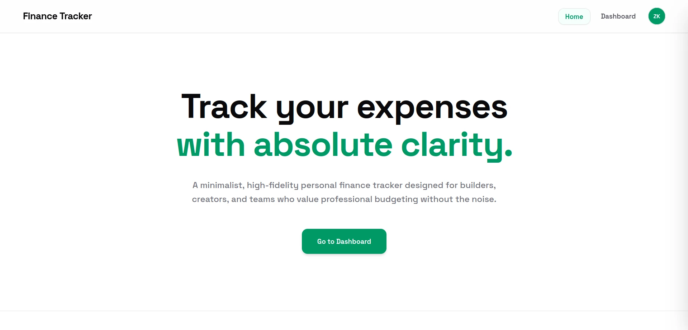
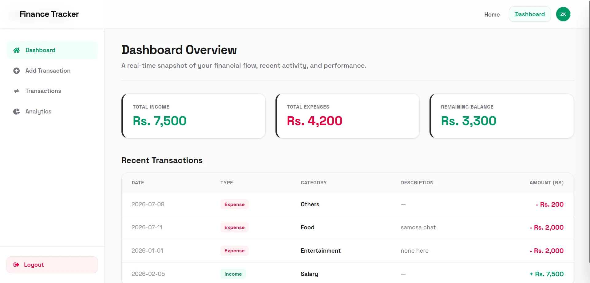
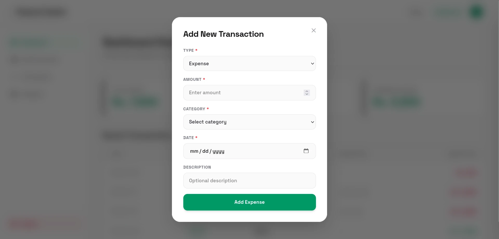
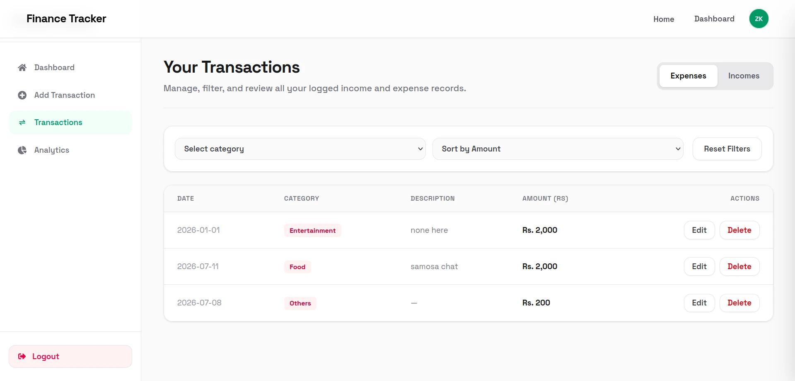
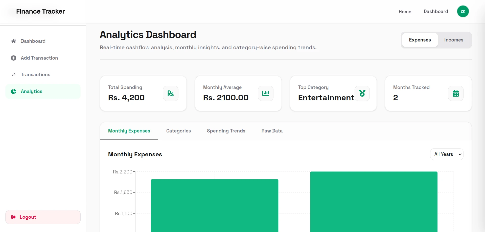
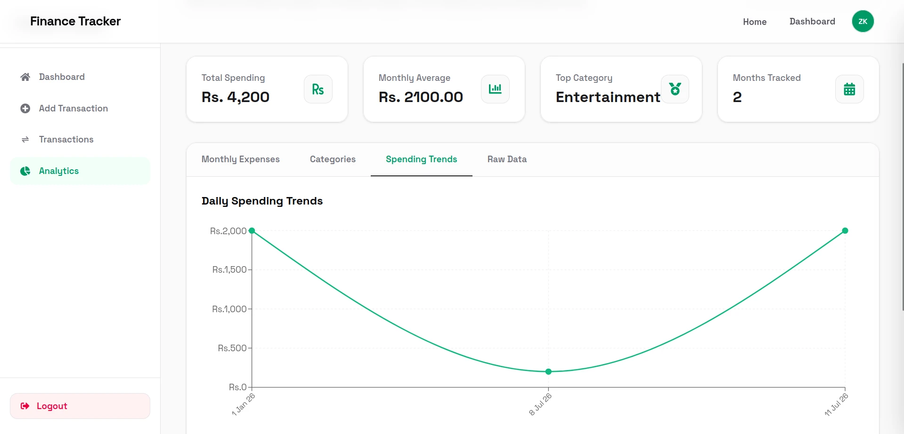

# Finance Tracker

A full-stack personal finance application built using the MERN stack (MongoDB, Express, React, Node.js). The application enables users to track incomes and expenses, view visual analytics, and manage transactions.

## Key Features

- **User Authentication**: Secure signup and login flow powered by JSON Web Tokens (JWT) and passwords hashed using bcrypt.
- **Automatic Token Attachment**: Axios request interceptors automatically read the JWT from local storage and attach it to the `Authorization` header for all protected API requests.
- **Automatic Session Expiration**: Axios response interceptors catch 401 Unauthorized errors, clear invalid local storage data, and redirect users to the login route.
- **Transaction Management**: Detailed logging of incomes and expenses with attributes including amount, category, date, and description.
- **Interactive Visual Analytics**: Data visualization using Recharts to present spending trends and category distributions.
- **State Management**: React Redux and Redux Toolkit manage user authentication state globally across the application.
- **Database Architecture**: Mongoose schemas map relations between users and transaction documents with connection caching for optimization.

## Technical Stack

### Frontend
- **React 19**: Component-based user interface rendering.
- **Vite**: Frontend build tool and development server.
- **Redux Toolkit & React Redux**: Centralized state management for user authentication.
- **Tailwind CSS v4**: Utility-first styling framework with compilation via `@tailwindcss/vite`.
- **Recharts**: Chart library for rendering data dashboards.
- **Axios**: HTTP client equipped with request and response interceptors.
- **React Router Dom**: Client-side routing for multi-page navigation.
- **React Hot Toast**: Temporary notifications for system alerts.

### Backend
- **Node.js & Express**: Core runtime and web server framework.
- **Mongoose**: Object Data Modeling (ODM) library for MongoDB.
- **jsonwebtoken**: Token generation and validation for stateless session management.
- **bcrypt**: Cryptographic hashing of passwords.
- **cors**: Middleware to handle Cross-Origin Resource Sharing.
- **dotenv**: Environment variable configuration management.

### Database / Services
- **MongoDB**: Document database storing user and transaction records.

---

## Local Development Setup

### Prerequisites
- Node.js (v18 or higher recommended)
- npm or yarn
- A running MongoDB instance (local or Atlas)

### 1. Clone the Repository
```bash
git clone https://github.com/your-username/Finance-Tracker_Mern.git
cd Finance-Tracker_Mern
```

### 2. Backend Configuration & Setup

1. Navigate to the backend directory:
   ```bash
   cd backend
   ```
2. Install the backend dependencies:
   ```bash
   npm install
   ```
3. Create a `.env` file in the `backend` folder:
   ```env
   PORT=5000
   MONGO_URI=mongodb://localhost:27017/expense-tracker
   JWT_SECRET=your_jwt_secret_key_here
   EXCHANGE_API_KEY=your_exchange_api_key_here
   ```
4. Start the backend development server:
   ```bash
   npm run dev
   ```
   The backend server will run on `http://localhost:5000`.

### 3. Frontend Configuration & Setup

1. Open a new terminal and navigate to the frontend directory:
   ```bash
   cd frontend
   ```
2. Install the frontend dependencies:
   ```bash
   npm install
   ```
3. Create a `.env` file in the `frontend` folder:
   ```env
   VITE_API_URL=http://localhost:5000
   ```
4. Start the frontend development server:
   ```bash
   npm run dev
   ```
   The frontend application will run on `http://localhost:5173`.

---

## Screenshots

Below are interface previews from the application:

### Dashboard Overview


### Login Page


### Expense & Income Visualizations


### Add Transactions


### Transaction Ledger


### Category-wise Breakdown

